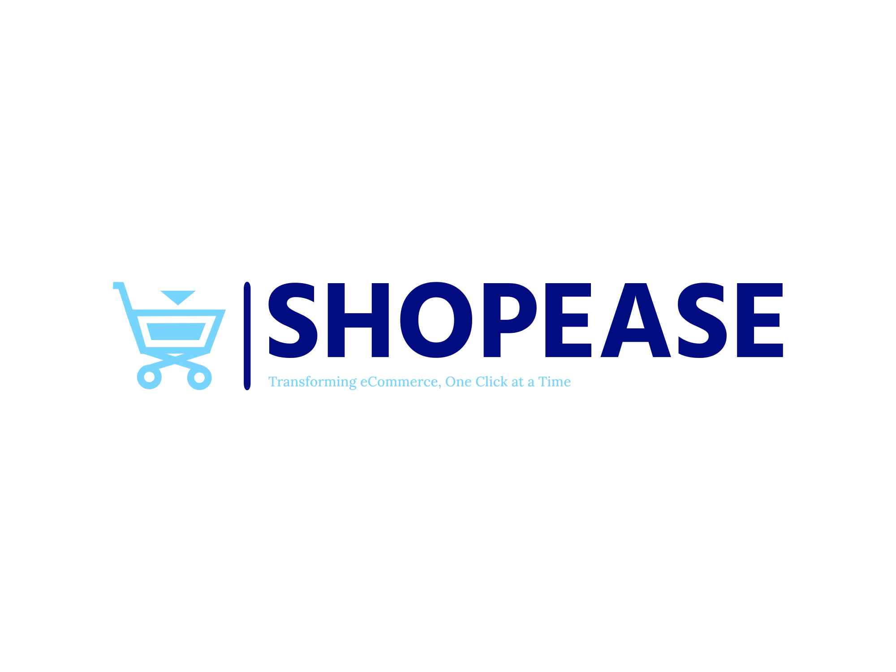

# ShopEase Admin Framework

Welcome to **ShopEase Admin Framework**, an innovative solution designed to revolutionize eCommerce management without the bloat and complexity of traditional platforms. ShopEase is tailored to provide a seamless, efficient, and user-friendly experience for online store owners and managers. Here's why ShopEase is your ideal open-source solution for eCommerce:

## A Fresh Approach to eCommerce

Tired of complex and heavyweight eCommerce platforms, we embarked on a mission to create something better. ShopEase Admin Framework is a result of our dedication to providing a straightforward and efficient solution for eCommerce businesses:

- **Simplicity First**: ShopEase was built from the ground up with a focus on simplicity, making it easier for you to manage your online store without unnecessary complexities.

- **Independent Solution**: We are not tied to any existing platform or CMS, giving you the freedom to manage your eCommerce business without any external dependencies.

- **Open Source**: ShopEase Admin Framework is open-source, meaning you have full access to the code, can customize it to your needs, and collaborate with a growing community of like-minded individuals.

## Roadmap

### Phase 1: Foundation

- **Project Inception**: Define the project's scope, objectives, and target audience.
- **Technology Stack Selection**: Choose the appropriate technologies for the framework.
- **Basic Architecture**: Establish the core architecture of the admin framework.

### Phase 2: User-Centric Design

- **User Research**: Conduct user research to understand the pain points of eCommerce administrators.
- **UI/UX Design**: Create a user-friendly and intuitive admin interface.
- **Prototype Development**: Build a functional prototype for initial testing.

### Phase 3: Core Functionality

- **Dashboard**: Develop a customizable dashboard with key business insights.
- **Inventory Management**: Implement product and inventory management features.
- **Order Processing**: Create a streamlined order processing system.
- **Customer Management**: Develop tools for managing customer data and order history.
- **Analytics and Reporting**: Build reporting and analytics features.
- **Security**: Implement user authentication and authorization mechanisms.

### Phase 4: Multi-Store Support

- **Multi-Store Features**: Enhance the framework to support multiple stores from a single admin interface.
- **Customization**: Enable users to tailor the framework to their unique business needs.

### Phase 5: Integration

- **API Integration**: Develop API endpoints for integration with third-party services.
- **Extensions**: Create a marketplace for extensions to extend the framework's functionality.

### Phase 6: Testing and Optimization

- **Testing**: Rigorously test the framework for bugs and performance issues.
- **User Feedback**: Gather feedback from early users for further improvements.
- **Optimization**: Optimize code and performance based on testing and feedback.

### Phase 7: Documentation and Release

- **Documentation**: Create comprehensive documentation, including installation guides, user manuals, and API references.
- **Stable Release**: Prepare for the initial stable release of ShopEase Admin Framework.

## Technologies Used

ShopEase Admin Framework leverages cutting-edge technologies to provide a robust and user-friendly eCommerce admin solution:

- **Frontend**:
  - **React** or **Svelte**: For building the dynamic user interface.
  - **Redux** (if using React): To manage state and data flow within the application.
  - **UI Framework**: Utilize a UI framework for creating a modern and responsive UI.

- **Backend**:
  - **Node.js**: For server-side development and API creation.
  - **Express.js**: To build the API endpoints.
  - **Laravel**: For the admin panel and backend management.

- **Database**:
  - **Node.js**: Utilize Node.js libraries for database interactions.
  - **MySQL** or **MongoDB**: Depending on your specific needs and data requirements.

- **Authentication & Security**:
  - **JWT** or **OAuth2**: To handle user authentication.
  - **Passport.js** (if using Node.js): For authentication middleware.
  - **OWASP**: Implement security best practices to protect against common web vulnerabilities.

- **Reporting & Analytics**:
  - **Chart.js** or other charting libraries: For generating interactive charts and graphs.
  - **Google Analytics API**: To gather eCommerce analytics data.

- **Deployment & DevOps**:
  - **Docker**: For containerization.
  - **Kubernetes** (if needed): For container orchestration.
  - **CI/CD pipelines**: Automate testing and deployment processes.

- **Integration & Extensibility**:
  - **RESTful APIs**: To facilitate third-party integrations.
  - **Extension Marketplace**: Allow users to extend functionality via Laravel packages.

## Workflow

To ensure a smooth development process, we follow this workflow:

1. **Issue Creation**: We use GitHub Issues to track tasks, enhancements, and bugs. If you identify an issue or have a feature request, please [create a new issue](https://github.com/7Pebbles/ShopEase_Admin/issues).

2. **Fork the Repository**: If you want to contribute, fork the repository to your own GitHub account.

3. **Clone the Repository**: Clone the forked repository to your local development environment.

4. **Branching**: Create a new branch for your work: `git checkout -b feature/your-feature-name`.

5. **Development**: Make your changes, add new features, or fix bugs in your branch.

6. **Testing**: Ensure that your changes pass all tests.

7. **Pull Request**: Open a pull request from your branch to the main repository's `develop` branch.

8. **Review**: Collaborators and maintainers will review your code, provide feedback, and discuss potential improvements.

9. **Merge**: After approval, your changes will be merged into the `develop` branch.

10. **Deployment**: Periodically, changes from the `develop` branch will be merged into the `main` branch for stable releases.

## Get Involved as a Volunteer

We welcome volunteers to help us make ShopEase Admin Framework even better! Whether you're a developer, designer, tester, or documentation enthusiast, your contributions are valuable.

- **Contributing**: Check out our [Contribution Guidelines](CONTRIBUTING.md) for detailed information on how to contribute.

- **Join the Discussion**: Participate in discussions and share your ideas in the [GitHub Issues](https://github.com/7Pebbles/ShopEase_Admin/issues) section.

- **Documentation**: Help improve our documentation by submitting pull requests with clarifications or enhancements.

- **Spread the Word**: Share ShopEase Admin Framework with others who might benefit from it.

## Contact

If you have any questions, suggestions, or just want to chat, feel free to reach out to us:

- **Email**: [7pebblesreportedtaste@gmail.com](7pebblesreportedtaste@gmail.com)
- **Twitter**: [Comming Soon](#)
- **LinkedIn**: [Commming_Soon](#)

We appreciate your interest and support in making ShopEase Admin Framework a success!

# Conclusion

ShopEase Admin Framework is poised to simplify and enhance eCommerce business management. With user-centric design and a powerful feature set, we're committed to making eCommerce administration more accessible and functional. Stay tuned for updates and our upcoming stable release!
